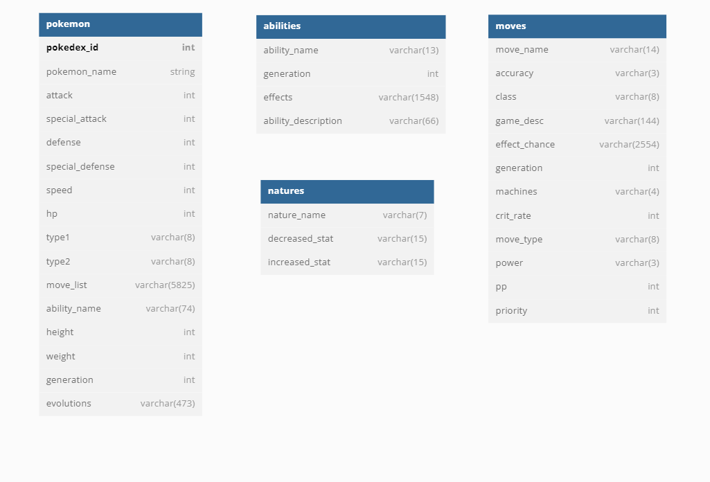

# MySQL Database

This repository contains the code and configuration files for a MySQL database.

## Requirements

- MySQL version 7.0 or higher
- Access to a server or hosting environment with MySQL installed

## Installation

1. Clone or download this repository to your local machine.
2. Create a new MySQL database and user.
3. Import the following files into your new database: `populateAbilityTable.sql`, `populateMovesTable.sql`, `populateNatureTable.sql`, `populatePokemonTable.sql`.
 This will create all of the necessary tables and populate them with initial data.
4. Edit the `config.ini` file and enter your database connection details.
5. Upload the files to your server or hosting environment.

## Installation with Amazon RDS

1. Sign up for an AWS account and log in to the AWS Management Console.
2. In the AWS Management Console, go to the RDS (Relational Database Service) page.
3. Click on the "Create database" button.
4. Choose the MySQL option and follow the on-screen instructions to set up your database. Ensure you use the proper configurations. Be sure to note the following connection details:
    Host: This is the endpoint of your RDS instance, which you can find on the RDS page in the AWS Management Console. It should be in the format <your-rds-instance-name>.<region>.rds.amazonaws.com.
    Name: This is the name of your database.
    Username: This is the username you specified when setting up your database.
    Password: This is the password you specified when setting up your database.
5. To connect to your database, you will need to use a MySQL client such as the mysql command-line tool or a GUI tool such as MySQL Workbench.
6. To connect using the mysql command-line tool, use the following command, replacing the placeholders with your own connection details.

## Connecting to Amazon RDS database instance

1. Use the `config.ini` file. Specify the --defaults-file option when connecting to the database, like this:
    `mysql --defaults-file=config.ini`

## Usage

Once the database is installed and configured, you can access it via your preferred MySQL client or by using the config.ini file included in this repository.

## Schema

The database has the following tables:

- `pokemon`: stores information about pokemon, including their name and stats.
- `abilities`: stores information about abilities, including ability names and descriptions.
- `natures`: stores information about natures, including nature name and stats of natures.
- `moves`: stores information about move, including the move name and move stats.

Here is a diagram showing the relationships between these tables:

## Files

1. `populateAbilityTable.sql` - populates abilities table.
2. `populateMovesTable.sql` - populates moves table.
3. `populateNatureTable.sql` - populates natures table.
4. `populatePokemonTable.sql` - populates pokemon table.
5. `dropAbilityTable.sql` - drops abilities table.
6. `dropMovesTable.sql` - drops moves table.
7. `dropNatureTable.sql` - drops natures table.
8. `dropPokemonTable.sql` - drops pokekmon table.
5. `config.ini`
